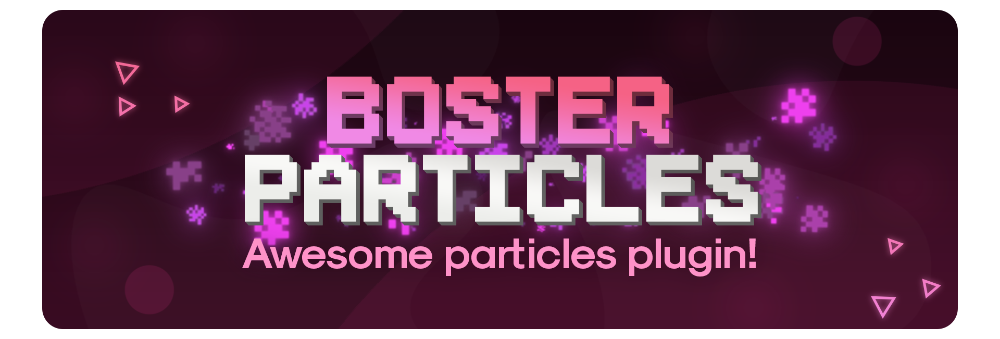

[![Contributors][contributors-shield]][contributors-url]
[![Forks][forks-shield]][forks-url]
[![Stargazers][stars-shield]][stars-url]
[![Issues][issues-shield]][issues-url]
[![MIT License][license-shield]][license-url]
[![LinkedIn][linkedin-shield]][linkedin-url]

<!-- PROJECT LOGO -->
 

  

<h3 align="center">BosterParticles</h3>

  

     
    <a href="https://github.com/Bosternike/BosterParticles"><strong>Explore the docs »</strong></a>
     
     
    <a href="https://github.com/Bosternike/BosterParticles/issues">Report Bug</a>
    ·
    <a href="https://github.com/Bosternike/BosterParticles/issues">Request Feature</a>
  

<!-- TABLE OF CONTENTS -->

  
About

  <ol>
    <li><a href="#api">API</a></li>
    <li><a href="#license">License</a></li>
    <li><a href="#contact">Contact</a></li>
  </ol>

<!-- API -->
## API 

See examples [here](https://github.com/Bosternike/BosterParticles/examples)

(<a href="#top">back to top</a>)

<!-- LICENSE -->
## License

Distributed under the MIT License. See `LICENSE.txt` for more information.

(<a href="#top">back to top</a>)

<!-- CONTACT -->
## Contact

<li>LinkedIn: [Andrew](https://www.linkedin.com/in/andrew-vlasov-9a37a21bb/)</li>
<li>Project Link: [source code](https://github.com/Bosternike/BosterParticles)</li>

(<a href="#top">back to top</a>)

[contributors-shield]: https://img.shields.io/github/contributors/Bosternike/BosterParticles.svg?style=for-the-badge
[contributors-url]: https://github.com/Bosternike/BosterParticles/graphs/contributors
[forks-shield]: https://img.shields.io/github/forks/Bosternike/BosterParticles.svg?style=for-the-badge
[forks-url]: https://github.com/Bosternike/BosterParticles/network/members
[stars-shield]: https://img.shields.io/github/stars/Bosternike/BosterParticles.svg?style=for-the-badge
[stars-url]: https://github.com/Bosternike/BosterParticles/stargazers
[issues-shield]: https://img.shields.io/github/issues/Bosternike/BosterParticles.svg?style=for-the-badge
[issues-url]: https://github.com/Bosternike/BosterParticles/issues
[license-shield]: https://img.shields.io/github/license/Bosternike/BosterParticles.svg?style=for-the-badge
[license-url]: https://github.com/Bosternike/BosterParticles/blob/master/LICENSE.txt
[linkedin-shield]: https://img.shields.io/badge/-LinkedIn-black.svg?style=for-the-badge&logo=linkedin&colorB=555
[linkedin-url]: https://linkedin.com/in/andrew-vlasov-9a37a21bb
[product-screenshot]: images/BosterParticles.png
